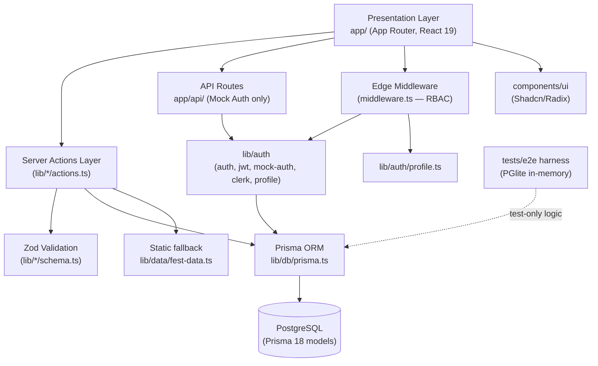
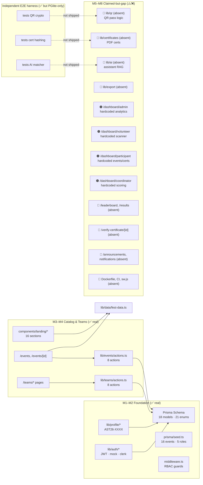
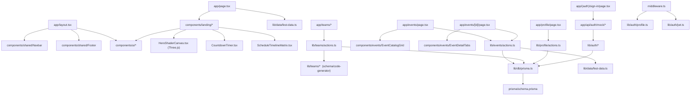
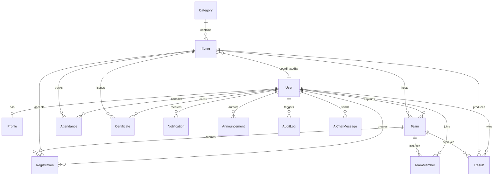
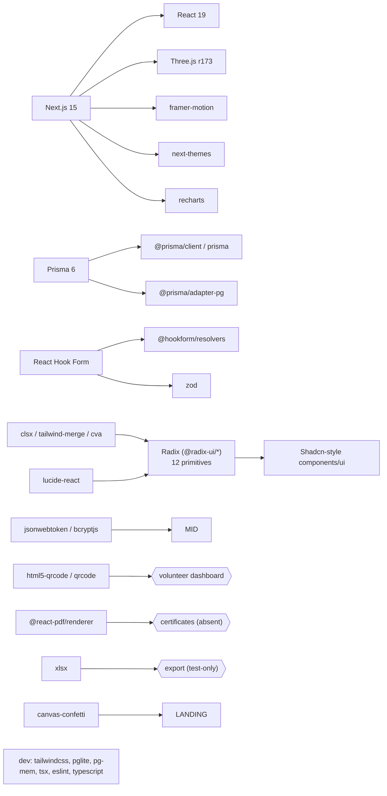

# ASTITVA 2K26 — Dependency Graph

**Generated:** 27 Aug 2026 · Represents the **actual shipped code** (verified), not the aspirational spec.

---

## 1. High-Level Architecture (verified against source)

---

## 2. Feature / Module Map with Implementation Status

Leaf color key — **green** = implemented & wired · **amber** = hardcoded UI or test-only · **red** = absent from app code.

---

## 3. Dependency Graph by Directory

---

## 4. Application Routes & Their Data Source (verified)

| Route | Kind | Data source | Status |
|:---|:---|:---|:---:|
| `/` | Static-rendered | fest-data + static sections | ✅ |
| `/events`, `/events/[id]` | DB / static fallback | `getEventsCatalog`, `getEventBySlugOrId` | ✅ |
| `/schedule`, `/gallery`, `/faq`, `/sponsors`, `/team` | Static | static data | ✅ |
| `/sign-in`, `/sign-up` | Mock Auth API | `lib/auth` + JWT | ✅ |
| `/profile` | DB | `getProfile` | ✅ |
| `/teams/*` | DB | `lib/teams/actions` | ✅ |
| `/dashboard/*` (5 roles) | **Hardcoded arrays** | — | ⚠️ |
| `/leaderboard`, `/results` | **—** | — | ❌ |
| `/announcements` | **—** | — | ❌ |
| `/verify-certificate/[id]` | **—** | — | ❌ |

---

## 5. Database Model Dependencies (Prisma relations)

**All 18 models exist** in `prisma/schema.prisma`. However, only **User/Profile, Category, Event, Registration, Team, TeamMember** are actively exercised by shipped server actions/dashboards; the rest (Attendance, Result, Certificate, Announcement, Notification, Sponsor, Faq, GalleryItem, CommitteeMember, AuditLog, AiChatMessage) are schema-only and either read via static data, hardcoded UI, or covered only by the PGlite test harness.

---

## 6. Third-Party Dependency Tree (`package.json` → concern)

---

## 7. Status Legend & Interpretation

- **✅ GREEN** — code exists, wired in the running app, and covered by the DB-connected server actions.
- **🟠 AMBER** — UI/mockup exists but uses hardcoded data (screens render, no DB reads for that feature).
- **🔴 RED** — referenced by spec/README/tests but **absent** from `app`/`components`/`lib`/`api`.
- The **E2E harness is a separate, self-contained layer** that validates formulas against in-memory PGlite; it does **not** prove the app screens are wired.

For full context, see `PROJECT_STATUS_REPORT.md`.
